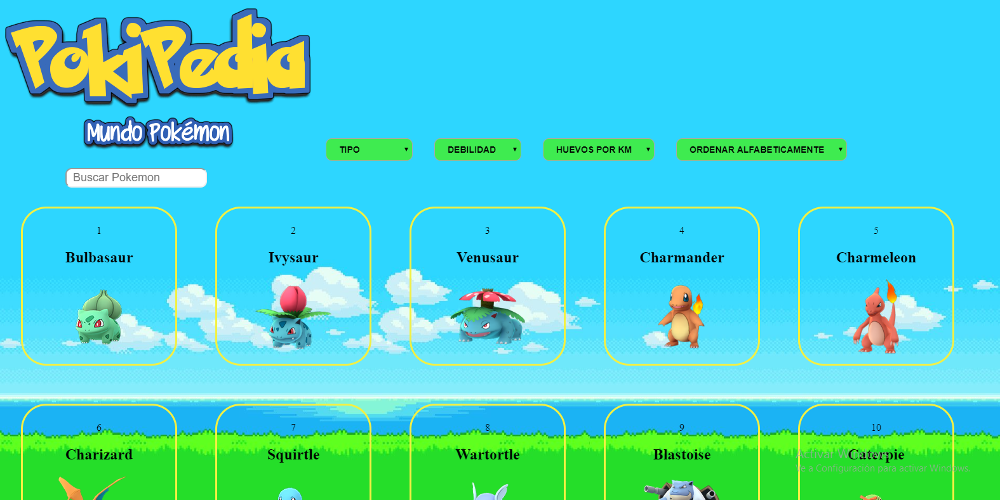
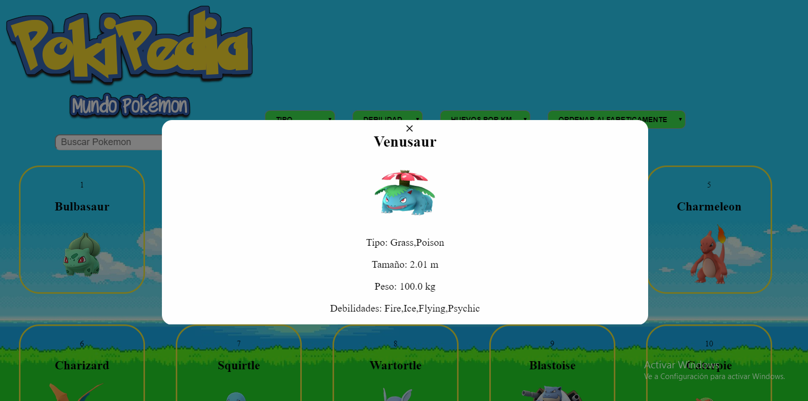
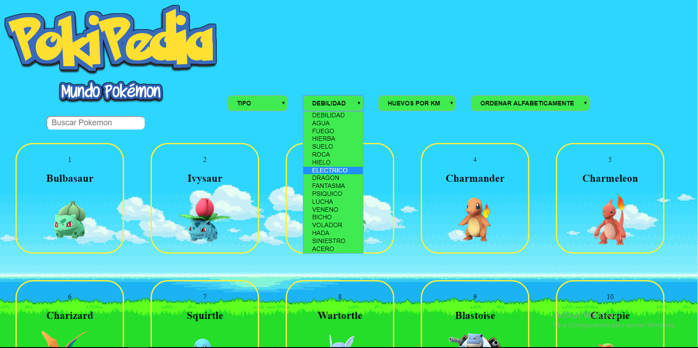
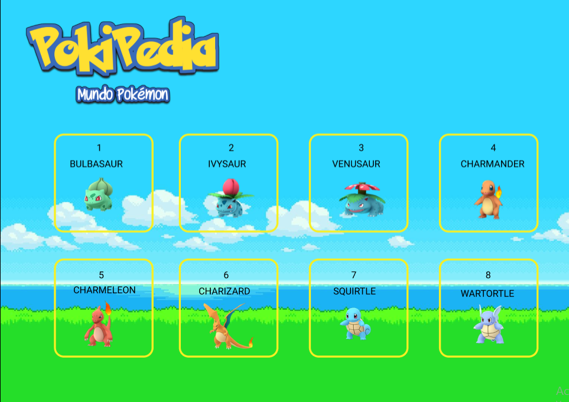
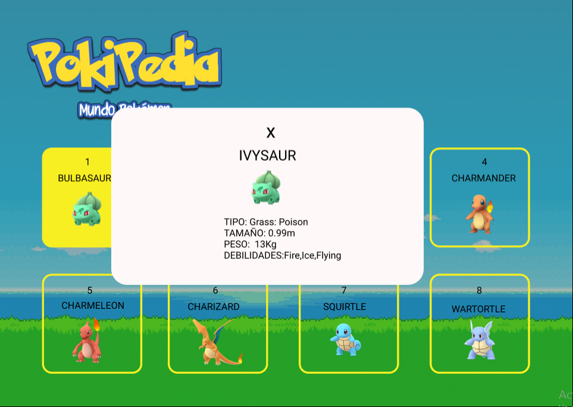

# ***POKIPEDIA***

El proyecto es una pagina web que permite a los jugadores o aficionados de Pokemon GO! acceder a una interfaz que les permite buscar información, interactuar mediante filtros sobre temas de interés respecto al juego.
***
* **FOTO**  

## INVESTIGACION UX:
* **USUARIOS Y OBEJTIVOS:**  
 El usuario al que va dirigido esta pagina web son para jugadores de Pokemon Go! o personas interesadas en conocer datos sobre los pokemon.

 * **SOLUCIONES:**  
 Mediante la inteerfaz llamativa de esta pagina web le permite al usuario hacer mas interactiva su busqueda y obtener la informacion que necesita.
 * **FOTO DE PROTOTIPO FINAL:**

!

### UX

- [X] Diseñar la aplicación pensando y entendiendo al usuario.
- [X] Crear prototipos para obtener _feedback_ e iterar.
- [X] Aplicar los principios de diseño visual (contraste, alineación, jerarquía).
- [X] Planear y ejecutar _tests_ de usabilidad.

### HTML y CSS

- [X] Entender y reconocer por qué es importante el HTML semántico.
- [X] Identificar y entender tipos de selectores en CSS.
- [ ] Entender como funciona `flexbox` en CSS.
- [X] Construir tu aplicación respetando el diseño planeado (maquetación).

### DOM

- [ ] Entender y reconocer los selectores del DOM (querySelector | querySelectorAll).
- [X] Manejar eventos del DOM. (addEventListener)
- [ ] Manipular dinámicamente el DOM. (createElement, appendchild, innerHTML, value)

### Javascript

- [ ] Manipular arrays (`filter` | `map` | `sort` | `reduce`).
- [ ] Manipular objects (key | value).
- [ ] Entender el uso de condicionales (`if-else` | `switch`).
- [X] Entender el uso de bucles (`for` | `forEach`).
- [ ] Entender la diferencia entre expression y statements.
- [X] Utilizar funciones (parámetros | argumentos | valor de retorno).
- [ ] Entender la diferencia entre tipos de datos atómicos y estructurados.
- [X] Utilizar ES Modules (`import` | `export`).

### Pruebas Unitarias (_testing_)
- [ ] Testear funciones (funciones puras).

### Git y GitHub
- [X] Ejecutar comandos de git (`add` | `commit` | `pull` | `status` | `push`).
- [] Utilizar los repositorios de GitHub (`clone` | `fork` | gh-pages).
- [X] Colaborar en Github (pull requests).

### Buenas prácticas de desarrollo
- [X] Organizar y dividir el código en módulos (Modularización).
- [ ] Utilizar identificadores descriptivos (Nomenclatura | Semántica).
- [X] Utilizar linter para seguir buenas prácticas (ESLINT).

